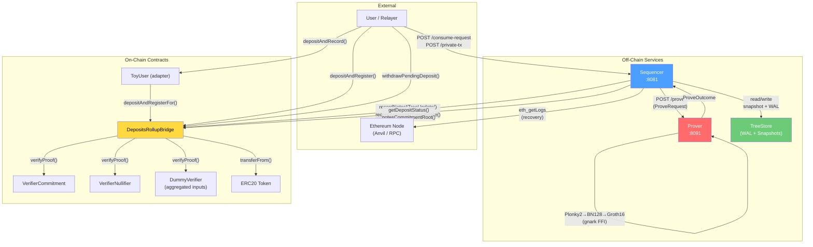

# System Overview

## Architecture Diagram

## Key Relationships

### Off-Chain → On-Chain

| Caller | Target | Method | Purpose |
|---|---|---|---|
| Sequencer | Bridge | `recordNotesCommitmentTreeUpdate()` | Finalize a commitment batch with proof |
| Sequencer | Bridge | `recordNotesNullifierTreeUpdate()` | Finalize a nullifier batch with proof |
| Sequencer | Bridge | `recordAccountsCommitmentTreeUpdate()` | Finalize an accounts commitment batch |
| Sequencer | Bridge | `recordAccountsNullifierTreeUpdate()` | Finalize an accounts nullifier batch |
| Sequencer | Bridge | `getDepositStatus()` | Preflight: check note is Pending/Validated |
| Sequencer | Bridge | `notesCommitmentRoot()` etc. | Verify local root matches on-chain |
| Sequencer | RPC | `eth_getLogs` | Recovery: replay finalized batches |

Batch semantics:
- Sequencer proves fixed-size batches (`batchSize`) and flushes partial pools on timeout by padding deterministic dummy leaves.
- On-chain calls may submit only real leaves (`0 < len <= batchSize`); the bridge re-derives omitted dummies before proof-input hashing.

### On-Chain Internal

| Caller | Target | Method | Purpose |
|---|---|---|---|
| Bridge | VerifierCommitment | `verifyProof()` | Verify commitment tree Groth16 proof |
| Bridge | VerifierNullifier | `verifyProof()` | Verify nullifier tree Groth16 proof |
| Bridge | DummyVerifier | `verifyProof()` | Verify aggregated input proof (stub) |
| Bridge | ERC20 Token | `transferFrom()` / `transfer()` | Escrow and release tokens |
| ToyUser | Bridge | `depositAndRegisterFor()` | Adapter for user deposits |

### Off-Chain Internal

| Caller | Target | Method | Purpose |
|---|---|---|---|
| Sequencer | Prover | `POST /prove` | Request Groth16 proof generation |
| Sequencer | TreeStore | `commit_batch()` | Persist tree state (WAL + snapshot) |
| Sequencer | TreeStore | `load_or_init()` | Load tree state on startup |

## Four Independent Trees

The system manages four Merkle trees, each with its own state, persistence, proof circuit, and on-chain root:

| Tree | Type | Purpose | Verifier |
|---|---|---|---|
| Notes Commitment | Append-only (depth 32) | Track validated note commitments | VerifierCommitment |
| Notes Nullifier | Chained insertion (depth 32) | Prevent double-spending of notes | VerifierNullifier |
| Accounts Commitment | Append-only (depth 32) | Track account output commitments | VerifierCommitment |
| Accounts Nullifier | Chained insertion (depth 32) | Prevent double-spending of accounts | VerifierNullifier |
