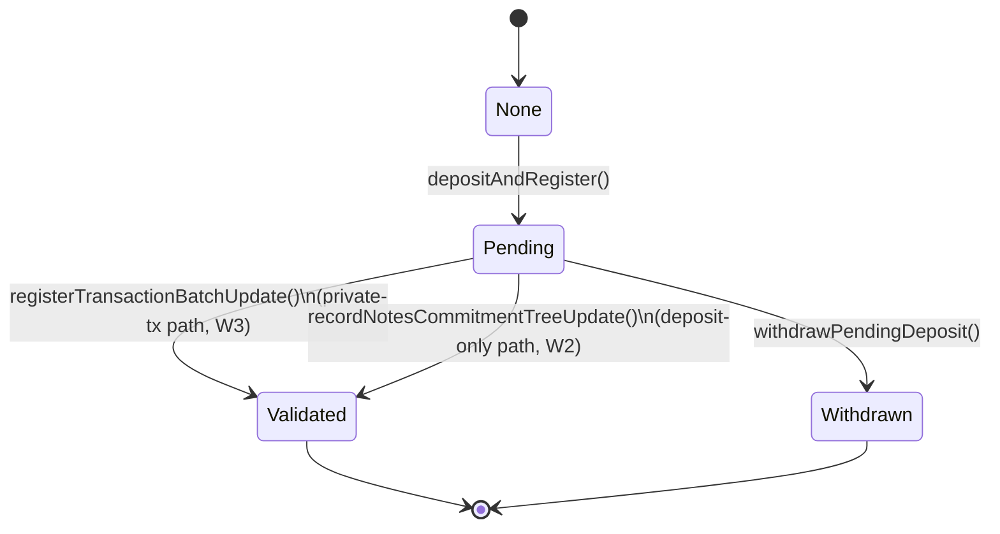

# Workflow Index

| # | Workflow | Description | Key Files |
|---|---|---|---|
| **W1** | [Deposit & Registration](04-w1-deposit-registration.md) | User escrows ERC20 tokens on-chain and registers a note commitment. Deposit status transitions from `None → Pending`. | `TesseraRollup.sol`, `ToyUser.sol` |
| **W2** | [Consume → Batch → Prove → Finalize (Deposit-Only)](05-w2-consume-batch-prove-finalize.md) | Deposit-only path: client submits a note to `/consume-request`; sequencer batches requests (full or timed partial with deterministic dummy padding), generates a ZK proof, and calls `recordNotesCommitmentTreeUpdate` on-chain. Status: `Pending → Validated`. | `api.rs`, `pipeline.rs`, `prover.rs`, `TesseraRollup.sol` |
| **W3** | [Private Transaction (Optimistic Two-Phase)](06-w3-private-transaction.md) | Main private-TX path: client submits `/private-tx`; sequencer applies all 4 tree updates locally, registers them atomically on-chain (`registerTransactionBatchUpdate`, status `Pending → Validated`), then submits 4 independent prove jobs; each tree is confirmed via `confirmTreeUpdate` as its proof arrives. | `api.rs`, `pipeline.rs`, `mod.rs`, `TesseraRollup.sol` |
| **W4** | [Withdrawal of Pending Deposit](07-w4-withdrawal.md) | User reclaims escrowed tokens before their note is included in a finalized batch. Status: `Pending → Withdrawn`. | `TesseraRollup.sol` |
| **W5** | [Sequencer Recovery from Chain](08-w5-sequencer-recovery.md) | Two-pass recovery: (1) replays `ValidatedBatchFinalized` events to rebuild confirmed tree roots; (2) replays `TransactionBatchRegistered` events to rebuild pending two-phase batches and re-queue unconfirmed prove jobs. | `recovery.rs`, `tree_store/mod.rs` |
| **W6** | [Prover Proof Generation](09-w6-prover-pipeline.md) | Prover receives a `ProveRequest` (with `batch_id` and `tree_index`), runs the Plonky2 → BN128 → Groth16 pipeline, and returns a `ProveOutcome`. Circuit selected by `tree_index`. | `prover.rs`, `wrapper.rs` |
| **W7** | [Generic Proof Aggregator (Plan)](13-generic-proof-aggregator-plan.md) | Planned generic recursive aggregator for independent proofs: configurable arity `2^k`, depth `d`, outputs one aggregated proof from `(2^k)^d` leaves with artifact-based fast initialization. | `tessera-trees/proof_aggregation/*` |

## Deposit Lifecycle State Machine

