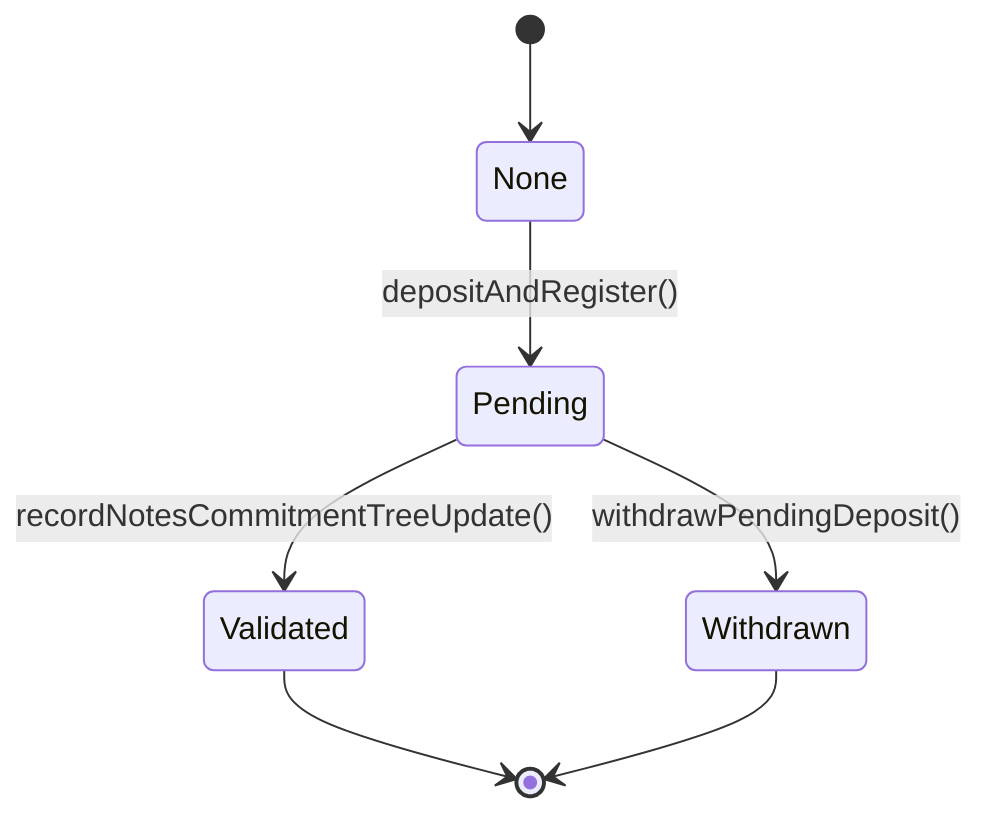

# Workflow Index

| # | Workflow | Description | Key Files |
|---|---|---|---|
| **W1** | [Deposit & Registration](04-w1-deposit-registration.md) | User escrows ERC20 tokens on-chain and registers a note commitment. Deposit status transitions from `None → Pending`. | `TesseraRollup.sol`, `ToyUser.sol` |
| **W2** | [Consume → Batch → Prove → Finalize](05-w2-consume-batch-prove-finalize.md) | Client submits note to sequencer API; sequencer batches requests (full or timed partial with deterministic dummy padding), generates ZK proof via prover, and finalizes the tree update on-chain. Status: `Pending → Validated`. | `api.rs`, `pipeline.rs`, `prover.rs`, `TesseraRollup.sol` |
| **W3** | [Private Transaction (Multi-Tree)](06-w3-private-transaction.md) | Client submits a full private TX with input/output notes and accounts; sequencer fans out leaves to 4 independent tree pipelines. | `api.rs`, `pipeline.rs` |
| **W4** | [Withdrawal of Pending Deposit](07-w4-withdrawal.md) | User reclaims escrowed tokens before their note is included in a finalized batch. Status: `Pending → Withdrawn`. | `TesseraRollup.sol` |
| **W5** | [Sequencer Recovery from Chain](08-w5-sequencer-recovery.md) | New or restarted sequencer replays `ValidatedBatchFinalized` events to reconstruct local tree state from on-chain history. | `recovery.rs`, `tree_store/mod.rs` |
| **W6** | [Prover Proof Generation](09-w6-prover-pipeline.md) | Prover receives a `ProveRequest`, runs the Plonky2 → BN128 → Groth16 pipeline, and returns a `ProveOutcome` with Solidity-formatted proof. | `prover.rs`, `wrapper.rs` |

## Deposit Lifecycle State Machine

