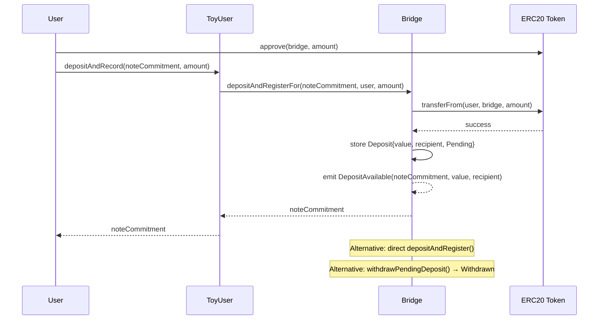

# W1: Deposit & Registration

## Overview

A user (or relayer) escrows ERC20 tokens into the `DepositsRollupBridge` contract and registers a note commitment. The deposit enters `Pending` status and becomes eligible for inclusion in a future commitment batch.

## Sequence Diagram



## Entry Points

### Direct Deposit
```solidity
function depositAndRegister(bytes32 noteCommitment, uint256 maxAmount) external whenNotPaused returns (bytes32)
```
- Caller is both payer and recipient
- Transfers tokens from `msg.sender` to bridge

### Relayer/Adapter Deposit
```solidity
function depositAndRegisterFor(bytes32 noteCommitment, address payer, uint256 maxAmount) external whenNotPaused returns (bytes32)
```
- Permissionless: anyone can call
- `payer` retains withdrawal rights as recipient
- Used by `ToyUser` adapter for UX improvements

### ToyUser Adapter (dev)
```solidity
function depositAndRecord(bytes32 noteCommitment, uint256 amount) external returns (bytes32)
function depositAndRecordWithPermit(...) external returns (bytes32)
```
- Convenience wrapper; the `WithPermit` variant combines EIP-2612 approve + deposit atomically

## Internal Logic (`_depositAndRegister`)

1. **Validate** note is unique (no existing deposit with same commitment)
2. **Validate** payer and recipient are non-zero addresses
3. **Validate** `maxAmount > 0`
4. **Snapshot** bridge's token balance before transfer
5. **Execute** `transferFrom(payer, bridge, maxAmount)`
6. **Snapshot** bridge's token balance after transfer
7. **Calculate** `value = newBalance - oldBalance` (handles fee-on-transfer tokens)
8. **Require** `value > 0`
9. **Store** `Deposit { value, recipient, status: Pending }`
10. **Emit** `DepositAvailable(noteCommitment, value, recipient)`

## Traceability

| Edge | File | Function |
|---|---|---|
| `depositAndRecord` | `tessera-solidity/src/ToyUser.sol` | `depositAndRecord()` |
| `depositAndRegisterFor` | `tessera-solidity/src/TesseraRollup.sol` | `depositAndRegisterFor()` |
| `_depositAndRegister` | `tessera-solidity/src/TesseraRollup.sol` | `_depositAndRegister()` |
| `transferFrom` | `tessera-solidity/src/TesseraRollup.sol` | balance-delta pattern in `_depositAndRegister()` |
| `DepositAvailable` event | `tessera-solidity/src/TesseraRollup.sol` | emitted at end of `_depositAndRegister()` |

## Error Paths

| Error | Condition |
|---|---|
| `DuplicateNoteCommitment(noteCommitment)` | Note already registered |
| `ZeroAddress()` | Payer or recipient is `address(0)` |
| `InvalidAmount()` | `maxAmount == 0` |
| `NoTokenReceived()` | Balance delta is zero after transfer |
| ERC20 revert | Token `transferFrom` fails (insufficient balance/allowance) |
