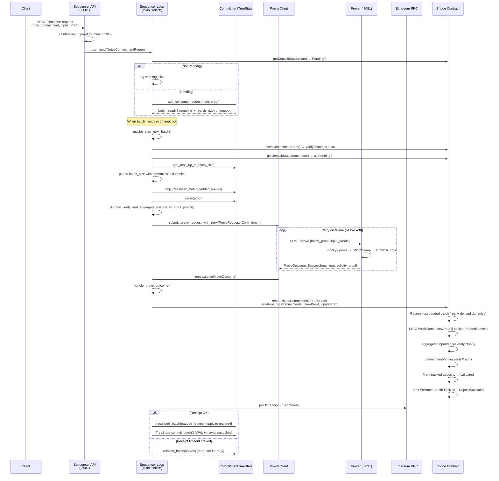

# W2: Consume Request → Batch → Prove → Finalize (Deposit-Only)

## Overview

This is the **deposit-only** path for the notes commitment tree. A client submits a note commitment to `/consume-request`. The sequencer validates, batches, generates a ZK proof (via the prover service), and calls `recordNotesCommitmentTreeUpdate` on-chain. Deposit status transitions from `Pending → Validated`.

> **Note:** The primary private-transaction path now uses the optimistic two-phase flow (W3), which registers all 4 tree roots atomically via `registerTransactionBatchUpdate` and confirms them independently via `confirmTreeUpdate`. W2 remains active for deposit-only use cases where only the notes commitment tree needs to be updated.

## Sequence Diagram

## Phases

### Phase 1: API Ingestion

1. Client sends `POST /consume-request` with `{ note_commitment, input_proof }`
2. Handler validates `input_proof` (Phase A stub: accepts `0x01`)
3. Sends `NotesCommitmentRequest` into `notes_commitment_tx` mpsc channel (capacity: 1024)

### Phase 2: Sequencer Validation

4. Main loop receives from channel via `tokio::select!`
5. Calls `bridge.getDepositStatus(note)` — must be `Pending`
6. Calls `state.add_consume_request()` — duplicate-guarded via `HashSet`
7. Requests ordered in `BTreeMap<EventOrderKey, PendingRequest>` by chain position

### Phase 3: Batch Formation

8. Triggered when `pending >= batch_size` OR timeout interval tick with `pending > 0`
9. `maybe_start_next_batch()` checks priority: NotesCommitment > NotesNullifier > AccountsCommitment > AccountsNullifier
10. Only proceeds if `current_batch == None` (one in-flight at a time)

### Phase 4: Batch Preflight

11. Verify local root matches on-chain root
12. Re-check each note's deposit status (fail-fast if any not Pending)
13. `pop_next_up_to(batch_size)` removes up to N oldest requests
14. Derive deterministic dummies if needed and pad to exactly `batch_size`
15. Clone tree, run `insert_batch(padded_leaves)` on clone, verify proof

### Phase 5: Proving

16. Aggregate associated input proofs (dummy stub)
17. Spawn async retry task: `submit_prove_request_with_retry()`
18. POST to prover with `ProveRequest::Commitment { batch_proof, input_proofs }`
19. Prover runs Plonky2 → BN128 → Groth16 pipeline (see [W6](09-w6-prover-pipeline.md))
20. On failure: retry every 5 seconds indefinitely

### Phase 6: On-Chain Finalization

21. Receive `ProveOutcome::Success` via `result_rx` channel
22. Call `bridge.recordNotesCommitmentTreeUpdate(newRoot, realCommitments[], treeProof, inputsProof)`
23. Contract re-derives dummy leaves, verifies both proofs, updates root, marks tracked real deposits Validated
24. Poll for TX receipt (60s timeout via `RECEIPT_TIMEOUT`)

### Phase 7: Local Commit

25. On receipt success: apply padded batch to real tree, persist via `TreeStore.commit_batch()`
26. On receipt failure/timeout: `reinsert_batch()` to re-queue real requests

## Traceability

| Edge | File | Function |
|---|---|---|
| `POST /consume-request` | `tessera-server/src/sequencer/api.rs` | `consume_request_handler()` |
| `mpsc::send` | `tessera-server/src/sequencer/api.rs` | via `notes_commitment_tx` channel |
| `add_consume_request` | `tessera-server/src/states/commitment_state.rs` | `add_consume_request()` |
| `maybe_start_next_batch` | `tessera-server/src/sequencer/pipeline.rs` | `maybe_start_next_batch()` |
| `pop_next_up_to` | `tessera-server/src/states/commitment_state.rs` | `pop_next_up_to()` |
| `insert_batch` | `tessera-trees/src/tree/commitment_tree/tree.rs` | `insert_batch()` |
| `submit_prove_request_with_retry` | `tessera-server/src/sequencer/pipeline.rs` | `submit_prove_request_with_retry()` |
| `POST /prove` | `tessera-server/src/bin/prover.rs` | `prove_handler()` |
| Plonky2→BN128→Groth16 | `tessera-server/src/prover.rs` | `CommitmentProverService::prove()` |
| `handle_prove_outcome` | `tessera-server/src/sequencer/pipeline.rs` | `handle_prove_outcome()` |
| `recordNotesCommitmentTreeUpdate` | `tessera-solidity/src/TesseraRollup.sol` | `recordNotesCommitmentTreeUpdate()` |
| `commit_batch` | `tessera-server/src/tree_store/mod.rs` | `commit_batch()` |
| `reinsert_batch` | `tessera-server/src/states/commitment_state.rs` | `reinsert_batch()` |

## Error Paths

| Failure | Behavior | Recovery |
|---|---|---|
| Note not Pending | Skip with warning log | Non-fatal; request discarded |
| Local root != on-chain root | Batch aborted | Recovery flow triggered |
| Prover unreachable | Infinite retry (5s backoff) | Blocks pipeline until resolved |
| Proof generation fails | `ProveOutcome::Failure` | Batch re-queued |
| TX receipt timeout (60s) | Batch re-queued | Re-attempts on next cycle |
| TX reverted | Batch re-queued, revert decoded | `humanize_bridge_revert()` logs reason |
| Duplicate note | `add_consume_request` returns false | Silently deduplicated |
