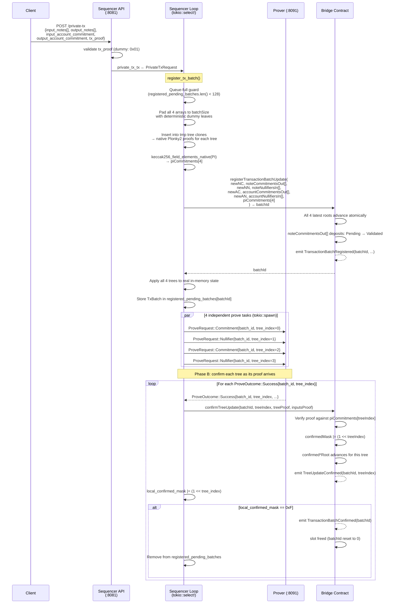

# W3: Private Transaction (Optimistic Two-Phase Register + Confirm)

## Overview

A client submits a full private transaction via `POST /private-tx`. The sequencer applies all four tree updates locally using temporary tree clones, then registers them on-chain in a single atomic call (`registerTransactionBatchUpdate`). Deposit status for output notes transitions `Pending → Validated` at register time. Proof generation for all four trees proceeds asynchronously and independently; each tree is confirmed via a separate `confirmTreeUpdate` call as its Groth16 proof arrives.

This is the primary throughput path. The deposit-only path (W2) remains for `/consume-request` but uses a single tree with proof-gated finalization.

## Sequence Diagram



## Root Semantics

Two independent root views are maintained per tree:

| Root Type | Contract Getter | Updated By | Semantics |
|---|---|---|---|
| Latest | `notesCommitmentRoot()` | `registerTransactionBatchUpdate` | Includes all registered updates (pending and confirmed) |
| Confirmed | `confirmedNotesCommitmentRoot()` | `confirmTreeUpdate` | Only proof-verified, fully confirmed updates |

The deposit status `Pending → Validated` is triggered atomically by `registerTransactionBatchUpdate`, not by proof confirmation.

## Request Body

```json
{
  "input_notes": ["0x...", "0x..."],
  "output_notes": ["0x...", "0x..."],
  "input_account_commitment": "0x...",
  "output_account_commitment": "0x...",
  "tx_proof": "0x01",
  "tx_id": "optional-tracking-id"
}
```

## Leaf Decomposition

Each field maps to one tree by `TREE_*` index constant:

| Field | Tree | Tree Index | Insertion Type | On-Chain Effect |
|---|---|---|---|---|
| `output_notes[]` | Notes Commitment | 0 | `insert_batch` | Deposits `Pending → Validated` |
| `input_notes[]` | Notes Nullifier | 1 | `insert_chained` | Nullifies spent notes |
| `output_account_commitment` | Accounts Commitment | 2 | `insert_batch` | Registers new account state |
| `input_account_commitment` | Accounts Nullifier | 3 | `insert_chained` | Nullifies old account state |

All four arrays are padded to exactly `batchSize` with deterministic dummy leaves before on-chain submission. The contract re-derives omitted dummies from `(treeType, batchStartIndex, realLeaves)`.

## Sequencer State

```rust
struct TxBatch {
    batch_id: u64,
    pi_commitments: [[u8; 32]; 4],   // submitted at register time; one per TREE_* index
    per_tree: [TxPerTreeBatch; 4],    // leaf data indexed by TREE_* constants
    local_confirmed_mask: u8,         // mirrors on-chain confirmedMask; complete at 0xF
}

// Tracked in Sequencer:
registered_pending_batches: BTreeMap<u64, TxBatch>  // batch_id → in-flight two-phase batch
```

## Queue Capacity

At most `MAX_PENDING_BATCHES = 128` two-phase batches can be registered simultaneously (mirrors the Solidity constant). When the local count reaches this limit, new `/private-tx` requests are logged and dropped.

## Error Handling

| Error | Behavior |
|---|---|
| Queue full (`registered_pending_batches.len() >= 128`) | Log warning; request dropped; non-fatal |
| `registerTransactionBatchUpdate` reverts | Log error; real trees unchanged (tmp-clone approach) |
| Prover unreachable for a tree | Retry with 5s backoff per `(batch_id, tree_index)` independently |
| `confirmTreeUpdate` reverts | Log warning; retried on next prove outcome cycle |

## Traceability

| Edge | File | Function |
|---|---|---|
| `POST /private-tx` | `tessera-server/src/sequencer/api.rs` | `private_tx_notes_handler()` |
| `private_tx_tx` send | `tessera-server/src/sequencer/api.rs` | `private_tx_notes_handler()` |
| `register_tx_batch` | `tessera-server/src/sequencer/pipeline.rs` | `register_tx_batch()` |
| `registerTransactionBatchUpdate` | `tessera-server/src/sequencer/pipeline.rs` | inside `register_tx_batch()` |
| `confirm_tx_batch_tree` | `tessera-server/src/sequencer/pipeline.rs` | `confirm_tx_batch_tree()` |
| `confirmTreeUpdate` | `tessera-server/src/sequencer/pipeline.rs` | inside `confirm_tx_batch_tree()` |
| `TxBatch` / `registered_pending_batches` | `tessera-server/src/sequencer/mod.rs` | `Sequencer` struct |
| `keccak256_field_elements_native` | `tessera-trees/src/plonky2_gadgets/keccak256/utils.rs` | PI commitment computation |

## Notes

- The `tx_proof` is validated by a dummy verifier (accepts `0x01` only). Real transaction proof verification is a future TODO.
- The `tx_id` field is optional and used for logging only.
- Individual trees confirm asynchronously; `confirmedMask` tracks partial completion on-chain.
- The deposit-only path (`/consume-request`) continues to use the per-tree `recordNotesCommitmentTreeUpdate` flow — see [W2](05-w2-consume-batch-prove-finalize.md).
