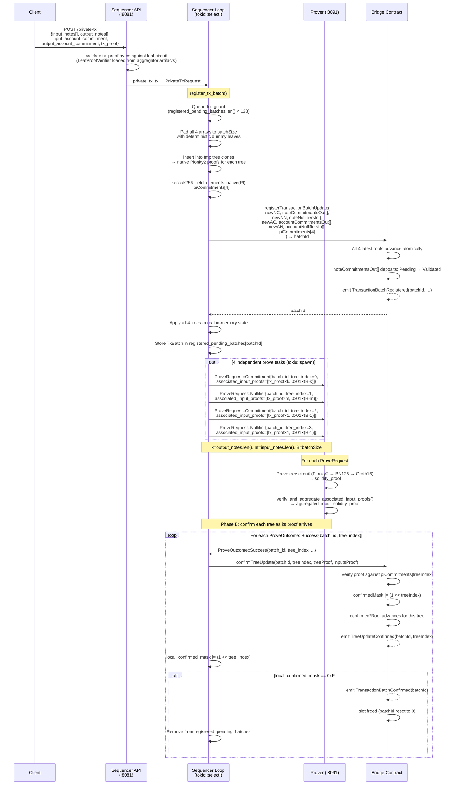

# W3: Private Transaction (Optimistic Two-Phase Register + Confirm)

## Overview

A client submits a full private transaction via `POST /private-tx`. The sequencer applies all four tree updates locally using temporary tree clones, then registers them on-chain in a single atomic call (`registerTransactionBatchUpdate`). Deposit status for output notes transitions `Pending → Validated` at register time. Proof generation for all four trees proceeds asynchronously and independently; each tree is confirmed via a separate `confirmTreeUpdate` call as its Groth16 proof arrives.

This is the primary throughput path. The deposit-only path (W2) remains for `/consume-request` but uses a single tree with proof-gated finalization.

## Sequence Diagram



## Root Semantics

Two independent root views are maintained per tree:

| Root Type | Contract Getter | Updated By | Semantics |
|---|---|---|---|
| Latest | `notesCommitmentRoot()` | `registerTransactionBatchUpdate` | Includes all registered updates (pending and confirmed) |
| Confirmed | `confirmedNotesCommitmentRoot()` | `confirmTreeUpdate` | Only proof-verified, fully confirmed updates |

The deposit status `Pending → Validated` is triggered atomically by `registerTransactionBatchUpdate`, not by proof confirmation.

## Request Body

```json
{
  "input_notes": ["0x...", "0x..."],
  "output_notes": ["0x...", "0x..."],
  "input_account_commitment": "0x...",
  "output_account_commitment": "0x...",
  "tx_proof": "<hex-encoded ProofWithPublicInputs bytes>",
  "tx_id": "optional-tracking-id"
}
```

`tx_proof` is the hex-encoded byte serialization of a Plonky2 `ProofWithPublicInputs<F, ConfigNative, 2>` for the transaction validity circuit.  All `batchSize` leaves in the Notes Commitment tree receive the same `tx_proof` as their `associated_input_proof`.

## Leaf Decomposition

Each field maps to one tree by `TREE_*` index constant:

| Field | Tree | Tree Index | Insertion Type | On-Chain Effect |
|---|---|---|---|---|
| `output_notes[]` | Notes Commitment | 0 | `insert_batch` | Deposits `Pending → Validated` |
| `input_notes[]` | Notes Nullifier | 1 | `insert_chained` | Nullifies spent notes |
| `output_account_commitment` | Accounts Commitment | 2 | `insert_batch` | Registers new account state |
| `input_account_commitment` | Accounts Nullifier | 3 | `insert_chained` | Nullifies old account state |

All four arrays are padded to exactly `batchSize` with deterministic dummy leaves before on-chain submission. The contract re-derives omitted dummies from `(treeType, batchStartIndex, realLeaves)`.

## Associated Input Proof Aggregation

Each `ProveRequest` carries an `associated_input_proofs: Vec<Vec<u8>>` — one serialized `tx_proof` per leaf in the batch.  The prover aggregates these into a single root proof using `AssociatedInputAggregatorService`, which wraps a `GenericAggregator<F, ConfigNative, D>` loaded from pre-built artifacts.

### Proof assignment per tree

| Tree Index | Real leaf positions | Padding positions |
|---|---|---|
| 0 — Notes Commitment | `tx_proof` bytes (one per `output_note`) | `DUMMY` sentinel (`0x01`) |
| 1 — Notes Nullifier | `tx_proof` bytes (one per `input_note`) | `DUMMY` sentinel (`0x01`) |
| 2 — Accounts Commitment | `tx_proof` bytes (one, for the output account leaf) | `DUMMY` sentinel (`0x01`) |
| 3 — Accounts Nullifier | `tx_proof` bytes (one, for the input account leaf) | `DUMMY` sentinel (`0x01`) |

All four `associated_input_proofs` vectors are exactly `batchSize` long.

### Aggregation logic (`aggregate_associated_input_proofs`)

1. **DUMMY expansion**: `DUMMY` sentinel bytes (`0x01`) are replaced with `canonical_padding_proof` — a valid Plonky2 proof of the dummy leaf circuit with all-zero public inputs, pre-computed at prover startup.
2. **Streaming aggregation**: all `batchSize` proofs (real + canonical padding) are submitted to the `GenericAggregator` via the `NodeProverPool` actor.
3. **Root verification**: `aggregator.verify_root()` validates the aggregated root proof.
4. **Groth16 wrapping**: `groth16_wrap_aggregation_root()` wraps the root through BN128 → `Groth16Wrapper::prove()` using the aggregation circuit keys, producing a real `aggregated_input_solidity_proof`.

| Condition | Result |
|---|---|
| Aggregator configured (`TESSERA_AGGREGATOR_ARTIFACTS_PATH` set) | Real Groth16 `aggregated_input_solidity_proof` |
| Aggregator not configured | `ProveOutcome::Failure` — private-tx path requires aggregation |

### GenericAggregator configuration

The aggregator is configured at artifact-build time with:

- **Leaf circuit**: the transaction validity circuit whose `CommonCircuitData` and `VerifierOnlyCircuitData` are stored in `leaf_common.bin` / `leaf_verifier.bin` under the artifact directory.
- **`arity^depth = batchSize`**: e.g. arity=2, depth=7 for a 128-leaf batch.
- **Reducer**: `Keccak256` — root PI is 8 Goldilocks field elements (256-bit big-endian digest), matching the on-chain PI shape consumed by `BN128Wrapper` and the Groth16 verifier.

Leaf proof bytes are deserialized via `ProofNative::from_bytes(bytes, aggregator.leaf_common())`.

### Artifact lifecycle

```bash
# Build aggregator artifacts once (or after any leaf-circuit change).
cargo run --bin aggregator_artifacts --release

# Point the prover at the artifacts.
export TESSERA_AGGREGATOR_ARTIFACTS_PATH=tessera-server/artifacts/associated-input-aggregator
```

When `TESSERA_AGGREGATOR_ARTIFACTS_PATH` is unset the prover starts without an aggregator and accepts only dummy (`0x01`) sentinel proofs.

## Sequencer State

```rust
struct TxBatch {
    batch_id: u64,
    pi_commitments: [[u8; 32]; 4],   // submitted at register time; one per TREE_* index
    per_tree: [TxPerTreeBatch; 4],    // leaf data indexed by TREE_* constants
    local_confirmed_mask: u8,         // mirrors on-chain confirmedMask; complete at 0xF
}

// Tracked in Sequencer:
registered_pending_batches: BTreeMap<u64, TxBatch>  // batch_id → in-flight two-phase batch
```

## Queue Capacity

At most `MAX_PENDING_BATCHES = 128` two-phase batches can be registered simultaneously (mirrors the Solidity constant). When the local count reaches this limit, new `/private-tx` requests are logged and dropped.

## Error Handling

| Error | Behavior |
|---|---|
| Queue full (`registered_pending_batches.len() >= 128`) | Log warning; request dropped; non-fatal |
| `registerTransactionBatchUpdate` reverts | Log error; real trees unchanged (tmp-clone approach) |
| Prover unreachable for a tree | Retry with 5s backoff per `(batch_id, tree_index)` independently |
| `confirmTreeUpdate` reverts | Log warning; retried on next prove outcome cycle |
| Mixed real/dummy associated input proofs | Prover returns `ProveOutcome::Failure`; sequencer retries |
| Real proofs with no aggregator configured | Prover returns `ProveOutcome::Failure` with actionable error message |
| Leaf proof deserialization failure | Prover returns `ProveOutcome::Failure`; leaf circuit mismatch likely |

## Traceability

| Edge | File | Function |
|---|---|---|
| `POST /private-tx` | `tessera-server/src/sequencer/api.rs` | `private_tx_notes_handler()` |
| `private_tx_tx` send | `tessera-server/src/sequencer/api.rs` | `private_tx_notes_handler()` |
| `register_tx_batch` | `tessera-server/src/sequencer/pipeline.rs` | `register_tx_batch()` |
| `registerTransactionBatchUpdate` | `tessera-server/src/sequencer/pipeline.rs` | inside `register_tx_batch()` |
| `confirm_tx_batch_tree` | `tessera-server/src/sequencer/pipeline.rs` | `confirm_tx_batch_tree()` |
| `confirmTreeUpdate` | `tessera-server/src/sequencer/pipeline.rs` | inside `confirm_tx_batch_tree()` |
| `TxBatch` / `registered_pending_batches` | `tessera-server/src/sequencer/mod.rs` | `Sequencer` struct |
| `keccak256_field_elements_native` | `tessera-trees/src/plonky2_gadgets/keccak256/utils.rs` | PI commitment computation |
| `AssociatedInputAggregatorService` | `tessera-server/src/prover.rs` | `verify_and_aggregate_associated_input_proofs()` |
| `GenericAggregator` | `tessera-trees/src/proof_aggregation/generic.rs` | `aggregate()`, `verify_root()`, `leaf_common()` |
| Aggregator artifacts path | `tessera-server/src/config.rs` | `TESSERA_AGGREGATOR_ARTIFACTS_PATH` env var |

## Notes

- The `tx_proof` field is a real Plonky2 `ProofWithPublicInputs` for the transaction validity circuit, serialized to bytes and hex-encoded.  The API validates it against the leaf circuit loaded from `TESSERA_AGGREGATOR_ARTIFACTS_PATH`; invalid bytes are rejected before the request reaches the sequencer loop.
- All four trees receive real `tx_proof` bytes at their real leaf positions. Padding positions across all four trees always use the `DUMMY` sentinel, which the prover expands to the canonical all-zero padding proof at aggregation time.
- Each `confirmTreeUpdate` call carries two Groth16 proofs: `solidity_proof` (tree circuit) and `aggregated_input_solidity_proof` (aggregation circuit). Both must verify on-chain.
- Recovery after a restart loses the original `tx_proof` bytes (not persisted to disk). Recovered batches use `DUMMY` sentinels for all slots, so the prover generates a canonical all-padding aggregated proof. This is mathematically valid but carries no real transaction validity guarantee — see [Assumptions & Gaps](11-assumptions-and-gaps.md) item 2.
- The `tx_id` field is optional and used for logging only.
- Individual trees confirm asynchronously; `confirmedMask` tracks partial completion on-chain.
- The deposit-only path (`/consume-request`) continues to use the per-tree `recordNotesCommitmentTreeUpdate` flow — see [W2](05-w2-consume-batch-prove-finalize.md).
