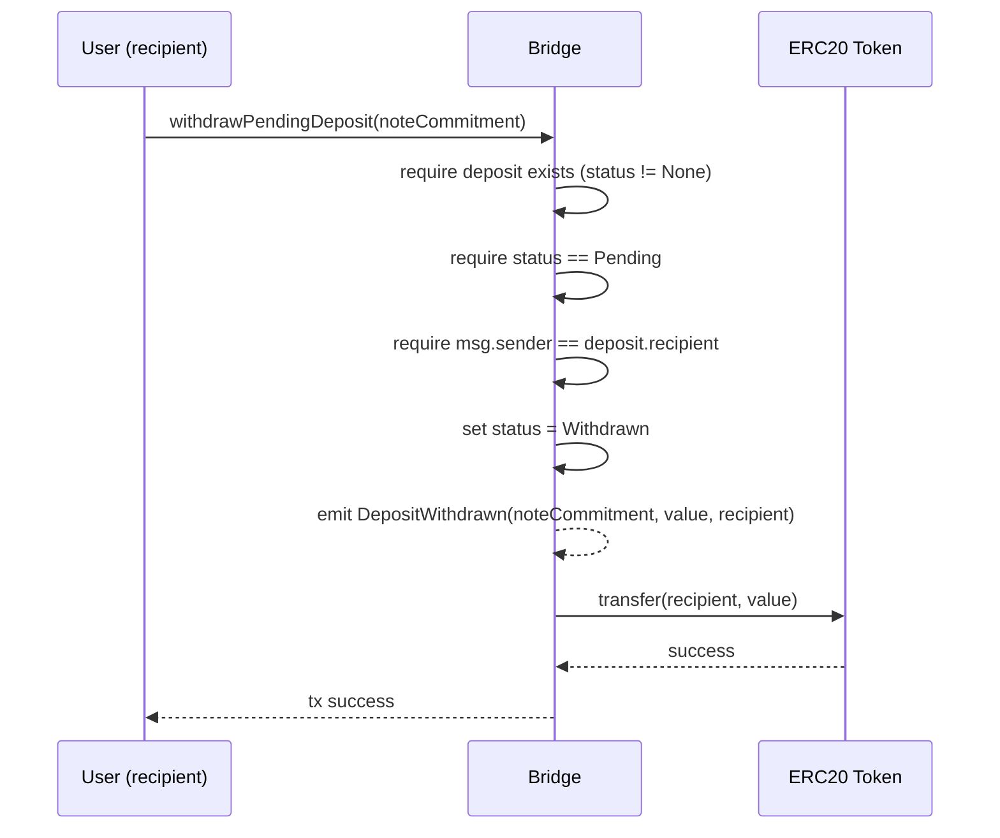

# W4: Withdrawal of Pending Deposit

## Overview

A user can reclaim their escrowed tokens at any time before the deposit is included in a finalized batch. This transitions the deposit from `Pending → Withdrawn`.

## Sequence Diagram



## Contract Function

```solidity
function withdrawPendingDeposit(bytes32 noteCommitment) external whenNotPaused
```

## Validation Rules

1. Deposit must exist (`status != None`) — reverts with `NoteNotFound`
2. Deposit must be `Pending` — reverts with `InvalidDepositState`
3. Caller must be the deposit `recipient` — reverts with `NotDepositRecipient`
4. Contract must not be paused — reverts with `PausedErr`

## State Transitions

```
Pending → Withdrawn (irreversible)
```

Once withdrawn, the note commitment cannot be reused for a new deposit (the record remains with `Withdrawn` status).

## Traceability

| Edge | File | Function |
|---|---|---|
| `withdrawPendingDeposit` | `tessera-solidity/src/TesseraRollup.sol` | `withdrawPendingDeposit()` |
| `DepositWithdrawn` event | `tessera-solidity/src/TesseraRollup.sol` | emitted in `withdrawPendingDeposit()` |
| `transfer` | `tessera-solidity/src/TesseraRollup.sol` | ERC20 token transfer back to recipient |

## Race Condition: Withdrawal vs. Batch Finalization

If a user submits a withdrawal while a batch containing their note is being proved:

- **Sequencer preflight** re-checks `getDepositStatus()` for each note before submitting the on-chain TX
- If the note is now `Withdrawn`, the entire batch is invalid and must be re-formed without that note
- The contract's `recordNotesCommitmentTreeUpdate()` will revert with `InvalidDepositState` if any tracked note is not `Pending`

This is a safe race: the on-chain check is the source of truth, and the sequencer handles batch failures by re-queuing.
