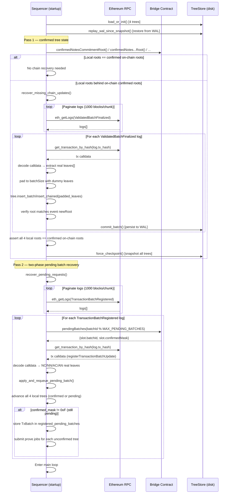

# W5: Sequencer Recovery from Chain

## Overview

When a sequencer starts (or restarts), it reconciles local tree state against the blockchain in two passes:

1. **`recover_missing_chain_updates()`** — replays `ValidatedBatchFinalized` events to catch up the four tree roots to their confirmed on-chain state.
2. **`recover_pending_requests()`** — replays `TransactionBatchRegistered` events to rebuild any two-phase batches that were registered but not yet fully confirmed, advancing the local trees through those batches and re-queuing prove jobs for unconfirmed trees.

This enables:

- **Crash recovery:** Sequencer restarts after an unclean shutdown
- **Cold start:** A new sequencer instance catches up from genesis
- **Multi-sequencer handoff:** Sequencer B catches up to batches finalized by Sequencer A

## Startup Sequence Diagram



## Pass 1: Confirmed Tree Recovery (`recover_missing_chain_updates`)

### Step 1: Load Local State

1. `TreeStore::load_or_init()` for each of the 4 trees
2. If a snapshot exists: deserialize tree state
3. `replay_wal_since_snapshot()`: apply WAL records since last snapshot (CRC32-verified)

### Step 2: Compare Against Confirmed Roots

4. Query on-chain **confirmed** roots: `confirmedNotesCommitmentRoot()`, `confirmedNotesNullifierRoot()`, etc.
   (These are the confirmed roots, not the latest/optimistic roots which include pending registered batches.)
5. Compare against local roots for all 4 trees
6. If all match: this pass is skipped

### Step 3: Fetch ValidatedBatchFinalized Events

7. Paginate `eth_getLogs` in chunks of 1000 blocks (`LOG_FETCH_CHUNK_BLOCKS`)
8. Filter by bridge address and `ValidatedBatchFinalized` event signature
9. Sort results by `(block_number, tx_index, log_index)`

### Step 4: Replay Each Finalized Batch

For each event log:

10. Fetch full transaction via `get_transaction_by_hash()`
11. Match tree type from event's `treeType` field:
    - `NotesCommitment` → decode `recordNotesCommitmentTreeUpdate` calldata
    - `NotesNullifier` → decode `recordNotesNullifierTreeUpdate` calldata
    - `AccountsCommitment` → decode `recordAccountsCommitmentTreeUpdate` calldata
    - `AccountsNullifier` → decode `recordAccountsNullifierTreeUpdate` calldata
12. Skip if log position is at or before the metadata cursor (prevents replay of already-applied batches)
13. Reconstruct full batch by deriving any omitted dummy leaves from `(treeType, batchStartIndex, realLeaves)`
14. Insert padded leaves into local tree (`insert_batch` for commitment, `insert_chained` for nullifier)
15. Verify the resulting root matches the event's `newRoot`
16. Persist to WAL via `TreeStore::commit_batch()`
17. Update metadata cursor (block, tx_index, log_index)

### Step 5: Verify & Checkpoint

18. Assert all 4 local roots now match confirmed on-chain roots (error if divergence)
19. `force_checkpoint()` writes fresh snapshots for all 4 trees

## Pass 2: Two-Phase Pending Batch Recovery (`recover_pending_requests`)

This pass re-applies two-phase batches (from `registerTransactionBatchUpdate`) that occurred after the confirmed-tree baseline, advancing the local tree state through all such batches and re-queuing prove jobs for those not yet fully confirmed.

### Step 1: Fetch TransactionBatchRegistered Events

1. Paginate `eth_getLogs` in chunks of 1000 blocks
2. Filter by bridge address and `TransactionBatchRegistered` event signature
3. Sort by `(block_number, tx_index, log_index)`

### Step 2: Check On-Chain Slot State

For each `TransactionBatchRegistered` event:

4. Compute `slotIndex = batchId % MAX_PENDING_BATCHES`
5. Call `bridge.pendingBatches(slotIndex)` to read `{batchId, confirmedMask}`
6. If `slot.batchId != batchId`: slot was freed → all 4 trees confirmed (`confirmed_mask = 0xF`)
7. Otherwise: use `slot.confirmedMask`

### Step 3: Recover Leaf Data

8. Fetch transaction by hash from the event log
9. Decode `registerTransactionBatchUpdateCall` calldata to recover the four real leaf arrays:
   - `noteCommitmentsOut` → NC real leaves
   - `noteNullifiersIn` → NN real leaves
   - `accountCommitmentsOut` → AC real leaves
   - `accountNullifiersIn` → AN real leaves

### Step 4: Apply and Requeue

10. `apply_and_requeue_pending_batch()`:
    - Pad each array to `batchSize` with deterministic dummies
    - Insert into all 4 local in-memory trees (advancing their roots)
    - If `confirmed_mask == 0xF`: done (advance only, no prove jobs)
    - If `confirmed_mask < 0xF`: store `TxBatch` in `registered_pending_batches`; submit prove jobs for each unconfirmed tree (`confirmed_mask & (1 << treeIndex) == 0`)

**Note on recovered proofs:** The original `tx_proof` bytes are not persisted across restarts. Re-submitted prove jobs use dummy associated-input proofs. For the notes-commitment tree, this means the aggregated-input proof from the prover will not verify on-chain until real proof persistence is implemented (future TODO).

## Crash Scenarios Handled

| Crash Point | Recovery Action |
|---|---|
| After `registerTransactionBatchUpdate` but before any prove job | All 4 prove jobs re-queued |
| After proof generated but before `confirmTreeUpdate` | Prove job not persisted; re-proven from tree state |
| After `confirmTreeUpdate` submitted but before receipt | On-chain `confirmedMask` read; already-confirmed trees skipped |
| Partial `confirmed_mask` (some trees confirmed, others not) | Only unconfirmed trees re-queued |

## Persistence Architecture

```
<tree_store_path>/
  ├── notes_commitment/
  │   ├── snapshot.bin      # Periodic tree state snapshot
  │   └── wal.bin           # Append-only write-ahead log
  ├── notes_nullifier/
  │   ├── snapshot.bin
  │   └── wal.bin
  ├── accounts_commitment/
  │   ├── snapshot.bin
  │   └── wal.bin
  └── accounts_nullifier/
      ├── snapshot.bin
      └── wal.bin
```

### WAL Record Format

```rust
struct WalRecord {
    values: Vec<[u8; 32]>,  // Batch leaves
    checksum: u32,           // CRC32 for corruption detection
}
```

### Snapshot Format

```rust
struct Snapshot<T> {
    version: u32,              // V1=1, V2=2
    wal_pos: u64,              // WAL position at snapshot time
    committed_batches: u64,    // Total batches applied
    last_block: u64,           // Chain cursor: block number
    last_tx_index: u64,        // Chain cursor: TX index
    last_log_index: u64,       // Chain cursor: log index
    state: T,                  // Serialized tree state
}
```

### Atomic Writes

All disk writes use the atomic write pattern:
1. Write to `<path>.tmp`
2. `fsync` the file
3. Rename atomically to `<path>`
4. Best-effort `fsync` on parent directory

## Traceability

| Edge | File | Function |
|---|---|---|
| `load_or_init` | `tessera-server/src/tree_store/mod.rs` | `load_or_init()` |
| `replay_wal_since_snapshot` | `tessera-server/src/tree_store/mod.rs` | `replay_wal_since_snapshot()` |
| `recover_missing_chain_updates` | `tessera-server/src/sequencer/recovery.rs` | `recover_missing_chain_updates()` |
| `apply_recovered_batch` | `tessera-server/src/sequencer/recovery.rs` | `apply_recovered_batch()` |
| `recover_pending_requests` | `tessera-server/src/sequencer/recovery.rs` | `recover_pending_requests()` |
| `apply_and_requeue_pending_batch` | `tessera-server/src/sequencer/recovery.rs` | `apply_and_requeue_pending_batch()` |
| `force_checkpoint` | `tessera-server/src/tree_store/mod.rs` | `force_checkpoint()` |
| `commit_batch` | `tessera-server/src/tree_store/mod.rs` | `commit_batch()` |

## Error Paths

| Failure | Behavior |
|---|---|
| WAL corruption (CRC mismatch) | Recovery stops; requires manual intervention |
| Root mismatch after confirmed-tree replay | Fatal error: divergence detected |
| RPC unavailable | Startup fails; sequencer does not enter main loop |
| Transaction decode failure | Batch skipped with warning |
| Snapshot version mismatch | V1 snapshots upgraded to V2 on next checkpoint |
| Two-phase batch slot already freed | Treated as fully confirmed; trees advanced only |
