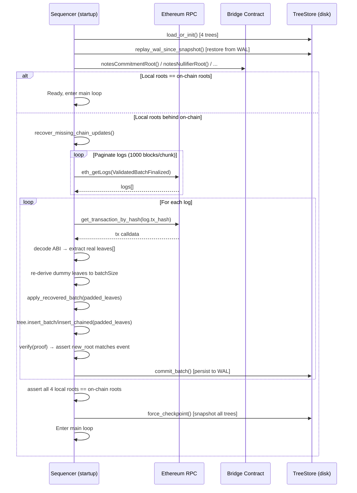

# W5: Sequencer Recovery from Chain

## Overview

When a sequencer starts (or restarts) and its local tree state is behind the on-chain state, it replays `ValidatedBatchFinalized` events from the blockchain to reconstruct the missing batches. This enables:

- **Crash recovery:** Sequencer restarts after an unclean shutdown
- **Cold start:** A new sequencer instance catches up from genesis
- **Multi-sequencer handoff:** Sequencer B catches up to batches finalized by Sequencer A

## Sequence Diagram



## Recovery Process

### Step 1: Load Local State

1. `TreeStore::load_or_init()` for each of the 4 trees
2. If a snapshot exists: deserialize tree state
3. `replay_wal_since_snapshot()`: apply WAL records since last snapshot (CRC32-verified)

### Step 2: Compare Roots

4. Query on-chain roots: `notesCommitmentRoot()`, `notesNullifierRoot()`, etc.
5. Compare against local roots for all 4 trees
6. If all match: recovery not needed, enter main loop

### Step 3: Fetch Missing Events

7. Paginate `eth_getLogs` in chunks of 1000 blocks (constant `LOG_FETCH_CHUNK_BLOCKS`)
8. Filter by bridge address and `ValidatedBatchFinalized` event signature
9. Sort results by `(block_number, tx_index, log_index)`

### Step 4: Replay Each Batch

For each event log:

10. Fetch full transaction via `get_transaction_by_hash()`
11. Match tree type from event's `treeType` field to ABI selector:
    - `NotesCommitment` → `recordNotesCommitmentTreeUpdate` selector
    - `NotesNullifier` → `recordNotesNullifierTreeUpdate` selector
    - `AccountsCommitment` → `recordAccountsCommitmentTreeUpdate` selector
    - `AccountsNullifier` → `recordAccountsNullifierTreeUpdate` selector
12. Decode calldata to extract the submitted (real) `commitments[]` array
13. Skip if log position is at or before the metadata cursor (prevents replay of already-applied batches)
14. Reconstruct full batch by deriving any omitted dummy leaves from `(treeType, batchStartIndex, realLeaves)`
15. Insert padded leaves into local tree (`insert_batch` for commitment, `insert_chained` for nullifier)
16. Verify the resulting root matches the event's `newRoot`
17. Persist to WAL via `TreeStore::commit_batch()`
18. Update metadata cursor (block, tx_index, log_index)

### Step 5: Verify & Checkpoint

18. Assert all 4 local roots now match on-chain roots (error if divergence)
19. `force_checkpoint()` writes fresh snapshots for all 4 trees

## Persistence Architecture

```
<tree_store_path>/
  ├── notes_commitment/
  │   ├── snapshot.bin      # Periodic tree state snapshot
  │   └── wal.bin           # Append-only write-ahead log
  ├── notes_nullifier/
  │   ├── snapshot.bin
  │   └── wal.bin
  ├── accounts_commitment/
  │   ├── snapshot.bin
  │   └── wal.bin
  └── accounts_nullifier/
      ├── snapshot.bin
      └── wal.bin
```

### WAL Record Format

```rust
struct WalRecord {
    values: Vec<[u8; 32]>,  // Batch leaves
    checksum: u32,           // CRC32 for corruption detection
}
```

### Snapshot Format

```rust
struct Snapshot<T> {
    version: u32,              // V1=1, V2=2
    wal_pos: u64,              // WAL position at snapshot time
    committed_batches: u64,    // Total batches applied
    last_block: u64,           // Chain cursor: block number
    last_tx_index: u64,        // Chain cursor: TX index
    last_log_index: u64,       // Chain cursor: log index
    state: T,                  // Serialized tree state
}
```

### Atomic Writes

All disk writes use the atomic write pattern:
1. Write to `<path>.tmp`
2. `fsync` the file
3. Rename atomically to `<path>`
4. Best-effort `fsync` on parent directory

## Traceability

| Edge | File | Function |
|---|---|---|
| `load_or_init` | `tessera-server/src/tree_store/mod.rs` | `load_or_init()` |
| `replay_wal_since_snapshot` | `tessera-server/src/tree_store/mod.rs` | `replay_wal_since_snapshot()` |
| `recover_missing_chain_updates` | `tessera-server/src/sequencer/recovery.rs` | `recover_missing_chain_updates()` |
| `apply_recovered_batch` | `tessera-server/src/sequencer/recovery.rs` | `apply_recovered_batch()` |
| `force_checkpoint` | `tessera-server/src/tree_store/mod.rs` | `force_checkpoint()` |
| `commit_batch` | `tessera-server/src/tree_store/mod.rs` | `commit_batch()` |

## Error Paths

| Failure | Behavior |
|---|---|
| WAL corruption (CRC mismatch) | Recovery stops; requires manual intervention |
| Root mismatch after replay | Fatal error: divergence detected |
| RPC unavailable | Startup fails; sequencer does not enter main loop |
| Transaction decode failure | Batch skipped with warning |
| Snapshot version mismatch | V1 snapshots upgraded to V2 on next checkpoint |
