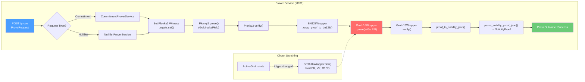

# W6: Prover Proof Generation Pipeline

## Overview

The prover is a standalone HTTP service that receives a `ProveRequest` from the sequencer, runs the full Plonky2 → BN128 → Groth16 proving pipeline, and returns a `ProveOutcome` with a Solidity-formatted proof ready for on-chain verification.

## Pipeline Diagram



## Request / Response Types

### ProveRequest

```rust
enum ProveRequest {
    Commitment {
        batch_proof: BatchCommitmentProof<Hash>,
        associated_input_proofs: Vec<Vec<u8>>,
    },
    Nullifier {
        batch_proof: NullifierChainedInsertProof<Hash>,
        associated_input_proofs: Vec<Vec<u8>>,
    },
}
```

### ProveOutcome

```rust
enum ProveOutcome {
    Success {
        new_root: Hash,
        solidity_proof: SolidityProof,
        aggregated_input_solidity_proof: SolidityProof,
    },
    Failure {
        error: String,
    },
}
```

### SolidityProof

```rust
struct SolidityProof {
    proof: [U256; 8],           // Groth16 proof points (A, B, C)
    commitments: [U256; 2],     // Pedersen commitments
    commitment_pok: [U256; 2],  // Pedersen commitment proof-of-knowledge
}
```

## Pipeline Steps

### 1. Circuit Selection

The `ProverRuntime` tracks which Groth16 circuit is currently loaded via `active: Option<ActiveGroth>`:

```rust
enum ActiveGroth {
    Commitment,
    Nullifier,
}
```

If the requested circuit type differs from the active one:
1. Call `Groth16Wrapper::init(plonky2_path, groth16_path)` to load proving key, verifying key, and R1CS
2. Verify initialization via `Groth16Wrapper::check_init()`
3. Update `self.active`

This switching is necessary because `Groth16Wrapper` is a **global FFI singleton** backed by a Go library.

### 2. Plonky2 Proof Generation

- Set circuit witness from the batch proof data
- Call `circuit_data.prove(pw)` to generate a native Plonky2 proof over GoldilocksField
- Immediately verify: `circuit_data.verify(proof)` (fail-fast sanity check)

### 3. BN128 Wrapping

- `BN128Wrapper::wrap_proof_to_bn128(plonky2_proof)` recursively wraps the native proof into a BN128-compatible proof
- This is required because Groth16 operates over BN254/BN128 curves, while Plonky2 uses Goldilocks

### 4. Groth16 Proof Generation (Go FFI)

- `Groth16Wrapper::prove(bn128_proof)` serializes the BN128 proof and calls into the Go gnark library via FFI
- Returns `(proof_bytes, public_input_bytes)`
- Immediately verify: `Groth16Wrapper::verify(proof, pub_inputs)`

### 5. Solidity Formatting

- `Groth16Wrapper::proof_to_solidity_json()` formats the Groth16 proof as JSON
- `parse_solidity_proof_json()` parses into the `SolidityProof` struct with `[U256; 8]` proof and `[U256; 2]` commitments

### 6. Input Proof Aggregation (Stub)

- `dummy_verify_and_aggregate_associated_input_proofs()` validates each associated proof is `[0x01]`
- Returns a placeholder `SolidityProof` with all zeros
- The on-chain `DummyVerifier` accepts this; real aggregation is Phase A TODO

## Concurrency Model

- The prover handler uses `tokio::task::spawn_blocking()` for CPU-intensive work
- `ProverRuntime` is behind `Arc<Mutex<...>>` — only **one proof at a time**
- The Groth16 FFI to Go uses global state — cannot be parallelized

## Artifact Layout

```
tessera-server/artifacts/
├── commitment-tree/
│   ├── plonky2-proof/
│   │   ├── common_circuit_data.json
│   │   ├── verifier_only_circuit_data.json
│   │   └── proof_with_public_inputs.json
│   └── groth-artifacts/
│       ├── r1cs.bin
│       ├── pk.bin
│       ├── vk.bin
│       └── Verifier.sol
└── nullifier-tree/
    ├── plonky2-proof/
    └── groth-artifacts/
```

## Traceability

| Edge | File | Function |
|---|---|---|
| `prove_handler` | `tessera-server/src/bin/prover.rs` | `prove_handler()` |
| `prove_request` | `tessera-server/src/prover.rs` | `ProverRuntime::prove_request()` |
| `CommitmentProverService::prove` | `tessera-server/src/prover.rs` | `CommitmentProverService::prove()` |
| `NullifierProverService::prove` | `tessera-server/src/prover.rs` | `NullifierProverService::prove()` |
| `wrap_proof_to_bn128` | `tessera-trees/src/groth/wrapper.rs` | `BN128Wrapper::wrap_proof_to_bn128()` |
| `Groth16Wrapper::prove` | `tessera-trees/src/groth/wrapper.rs` | `Groth16Wrapper::prove()` (Go FFI) |
| `Groth16Wrapper::verify` | `tessera-trees/src/groth/wrapper.rs` | `Groth16Wrapper::verify()` |
| `proof_to_solidity_json` | `tessera-trees/src/groth/wrapper.rs` | `Groth16Wrapper::proof_to_solidity_json()` |
| `parse_solidity_proof_json` | `tessera-server/src/prover.rs` | `parse_solidity_proof_json()` |
| `dummy_verify_and_aggregate` | `tessera-server/src/prover.rs` | `dummy_verify_and_aggregate_associated_input_proofs()` |

## Timeouts

| Parameter | Default | Configured Via |
|---|---|---|
| Prover HTTP timeout | 1800s (30 min) | `TESSERA_PROVER_API_TIMEOUT_SECS` |
| Sequencer retry backoff | 5s between attempts | Hardcoded in `submit_prove_request_with_retry()` |
