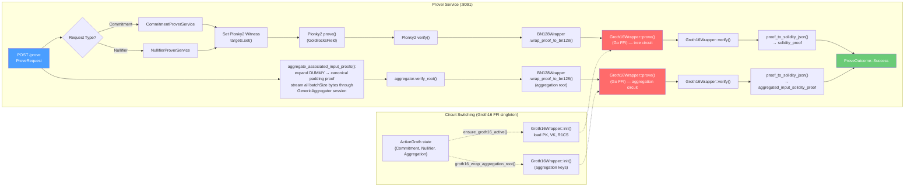

# W6: Prover Proof Generation Pipeline

## Overview

The prover is a standalone HTTP service that receives a `ProveRequest` from the sequencer, runs the full Plonky2 → BN128 → Groth16 proving pipeline for the tree circuit, and in parallel aggregates the associated input (transaction validity) proofs through a streaming session before wrapping the root through BN128 → Groth16. It returns a `ProveOutcome` with two Solidity-formatted proofs ready for on-chain verification.

## Pipeline Diagram



## Request / Response Types

### Tree Index Constants

```rust
pub const TREE_NOTES_COMMITMENT:    u8 = 0;
pub const TREE_NOTES_NULLIFIER:     u8 = 1;
pub const TREE_ACCOUNTS_COMMITMENT: u8 = 2;
pub const TREE_ACCOUNTS_NULLIFIER:  u8 = 3;
```

These mirror the Solidity `TREE_*` constants in `TesseraRollup.sol`.
`batch_id = 0` is reserved for the legacy deposit-only prove path.

### ProveRequest

```rust
enum ProveRequest {
    Commitment {
        batch_id: u64,                              // 0 for deposit-only path
        tree_index: u8,                             // TREE_NOTES_COMMITMENT or TREE_ACCOUNTS_COMMITMENT
        batch_proof: BatchCommitmentProof<Hash>,
        associated_input_proofs: Vec<Vec<u8>>,      // batchSize entries: real tx_proof or DUMMY sentinel
    },
    Nullifier {
        batch_id: u64,                              // 0 for deposit-only path
        tree_index: u8,                             // TREE_NOTES_NULLIFIER or TREE_ACCOUNTS_NULLIFIER
        batch_proof: NullifierChainedInsertProof<Hash>,
        associated_input_proofs: Vec<Vec<u8>>,      // batchSize entries: real tx_proof or DUMMY sentinel
    },
}
```

`associated_input_proofs` contains exactly `batchSize` entries. Real leaf positions carry serialized `ProofWithPublicInputs` bytes; padding positions carry the sentinel `[0x01]` which the prover expands to the canonical all-zero padding proof before aggregation.

### ProveOutcome

```rust
enum ProveOutcome {
    Success {
        batch_id: u64,                              // echoed from ProveRequest
        tree_index: u8,                             // echoed from ProveRequest
        new_root: Hash,
        solidity_proof: Box<SolidityProof>,                     // tree circuit Groth16 proof
        aggregated_input_solidity_proof: Box<SolidityProof>,    // aggregation circuit Groth16 proof
    },
    Failure {
        batch_id: u64,
        tree_index: u8,
        error: String,
    },
}
```

### SolidityProof

```rust
struct SolidityProof {
    proof: [U256; 8],           // Groth16 proof points (A, B, C)
    commitments: [U256; 2],     // Pedersen commitments
    commitment_pok: [U256; 2],  // Pedersen commitment proof-of-knowledge
}
```

## Pipeline Steps

### 1. Circuit Selection (tree proof)

`ProverRuntime` tracks which Groth16 circuit is loaded via `active: Option<ActiveGroth>`:

```rust
enum ActiveGroth {
    Commitment,   // notes/accounts commitment tree circuit
    Nullifier,    // notes/accounts nullifier tree circuit
    Aggregation,  // associated-input aggregator circuit
}
```

Circuit selection for the tree proof is driven by `tree_index`:
- `tree_index` ∈ {0, 2} → `Commitment` circuit
- `tree_index` ∈ {1, 3} → `Nullifier` circuit

`ensure_groth16_active(target)` reinitializes the FFI singleton only when the requested circuit differs from the active one. It must not be called with `Aggregation`; that variant is managed exclusively inside `groth16_wrap_aggregation_root`.

### 2. Plonky2 Proof Generation (tree)

- Set circuit witness from `batch_proof` via `targets.set()`
- `circuit_data.prove(pw)` → native Plonky2 proof over GoldilocksField
- `circuit_data.verify(proof)` — fail-fast sanity check

### 3. BN128 Wrapping (tree)

`BN128Wrapper::wrap_proof_to_bn128(plonky2_proof)` recursively wraps the Goldilocks proof into BN254-compatible form for Groth16.

### 4. Groth16 Proof Generation — tree circuit (Go FFI)

`Groth16Wrapper::prove(bn128_proof)` → `(proof_bytes, public_input_bytes)`, then `Groth16Wrapper::verify(proof, pub_inputs)`.

### 5. Solidity Formatting (tree proof)

`proof_to_solidity_json()` + `parse_solidity_proof_json()` → `SolidityProof` stored as `solidity_proof` in the outcome.

### 6. Associated Input Proof Aggregation

`aggregate_associated_input_proofs(aggregator, associated_input_proofs, batch_size)`:

1. **DUMMY expansion**: each `[0x01]` sentinel is replaced with `canonical_padding_proof` — a pre-generated, serialized Plonky2 proof of the dummy leaf circuit with all-zero public inputs. This proof is computed once at `AssociatedInputAggregatorService` startup.
2. **Streaming aggregation**: all `batchSize` proof bytes are submitted to a `start_aggregation_session` actor backed by the `NodeProverPool`. The actor fires node-prove tasks bottom-up as each node's children are ready.
3. **Root verification**: `aggregator.verify_root(&root_proof)` verifies the aggregated root plonky2 proof.

Requires `TESSERA_AGGREGATOR_ARTIFACTS_PATH` to be set; the prover fails to start if this path is configured but the artifacts are absent.

### 7. BN128 + Groth16 Wrapping — aggregation circuit

`groth16_wrap_aggregation_root(root_proof)`:

1. Reinitializes the Groth16 FFI singleton for the aggregation circuit (paths stored inside `AssociatedInputAggregatorService`).
2. `agg.bn128_wrapper.wrap_proof_to_bn128(root_proof)` → BN128 proof.
3. `Groth16Wrapper::prove(bn128_proof)` → `aggregated_input_solidity_proof`.
4. `Groth16Wrapper::verify()` — immediate check.

The Groth16 singleton is left in `ActiveGroth::Aggregation` state after this step; the next request that needs the tree circuit will trigger a reinitialization.

## Groth16 Singleton Sequencing

Within a single `prove_request` call the singleton is used twice with a mandatory circuit switch in between:

```
ensure_groth16_active(Commitment or Nullifier)
  → tree plonky2 → BN128 → Groth16::prove   [active = Commitment|Nullifier]

aggregate_associated_input_proofs()           [pure plonky2, no FFI]

groth16_wrap_aggregation_root()
  → Groth16Wrapper::init(aggregation keys)
  → aggregation BN128 → Groth16::prove       [active = Aggregation]
```

## Concurrency Model

- The prover handler uses `tokio::task::spawn_blocking()` for CPU-intensive work.
- `ProverRuntime` is behind `Arc<Mutex<...>>` — only **one proof at a time**.
- The Groth16 FFI to Go uses global state — cannot be parallelized.
- Async aggregation (`aggregate_bytes`) is driven synchronously via `Handle::current().block_on()` inside the blocking context.

## Canonical Padding Proof

At startup, `AssociatedInputAggregatorService::from_artifacts_and_pool()` rebuilds the dummy leaf circuit from `aggregator.leaf_common().num_public_inputs` unconstrained targets, proves it with all-zero witnesses, and serializes the result to `canonical_padding_proof: Vec<u8>`. This proof is cloned into every padding slot before aggregation — it is a valid leaf proof for the aggregator's leaf circuit and aggregates correctly.

## Artifact Layout

```
tessera-server/artifacts/
├── note-commitment-tree/
│   ├── plonky2-proof/         # BN128 wrapper artifacts
│   └── groth-artifacts/
│       ├── r1cs.bin
│       ├── pk.bin
│       ├── vk.bin
│       └── Verifier.sol       → tessera-solidity/src/VerifierNotesCommitment.sol
├── account-commitment-tree/
│   ├── plonky2-proof/
│   └── groth-artifacts/
│       └── Verifier.sol       → tessera-solidity/src/VerifierAccountsCommitment.sol
├── note-nullifier-tree/
│   ├── plonky2-proof/
│   └── groth-artifacts/
│       └── Verifier.sol       → tessera-solidity/src/VerifierNotesNullifier.sol
├── account-nullifier-tree/
│   ├── plonky2-proof/
│   └── groth-artifacts/
│       └── Verifier.sol       → tessera-solidity/src/VerifierAccountsNullifier.sol
└── associated-input-aggregator/
    ├── leaf_common.bin        # CommonCircuitData for the leaf (tx validity) circuit
    ├── leaf_verifier.bin      # VerifierOnlyCircuitData
    ├── level_*.bin            # Per-level aggregation circuit data
    ├── plonky2-proof/         # BN128 wrapper for the aggregation root circuit
    └── groth-artifacts/
        ├── r1cs.bin
        ├── pk.bin
        ├── vk.bin
        └── Verifier.sol       → tessera-solidity/src/VerifierAggregator.sol
```

Artifact generation commands:

```bash
cargo run --bin commitment_tree_artifacts --release
cargo run --bin nullifier_tree_artifacts  --release
cargo run --bin aggregator_artifacts      --release
scripts/sync_verifiers_from_artifacts.sh
```

## Traceability

| Edge | File | Function |
|---|---|---|
| `prove_handler` | `tessera-server/src/bin/prover.rs` | `prove_handler()` |
| `prove_request` | `tessera-server/src/prover.rs` | `ProverRuntime::prove_request()` |
| `ensure_groth16_active` | `tessera-server/src/prover.rs` | `ProverRuntime::ensure_groth16_active()` |
| `CommitmentProverService::prove` | `tessera-server/src/prover.rs` | `CommitmentProverService::prove()` |
| `NullifierProverService::prove` | `tessera-server/src/prover.rs` | `NullifierProverService::prove()` |
| `aggregate_associated_input_proofs` | `tessera-server/src/prover.rs` | `ProverRuntime::aggregate_associated_input_proofs()` |
| `groth16_wrap_aggregation_root` | `tessera-server/src/prover.rs` | `ProverRuntime::groth16_wrap_aggregation_root()` |
| `canonical_padding_proof` generation | `tessera-server/src/prover.rs` | `AssociatedInputAggregatorService::from_artifacts_and_pool()` |
| `aggregate_bytes` | `tessera-server/src/prover.rs` | `AssociatedInputAggregatorService::aggregate_bytes()` |
| `start_aggregation_session` | `tessera-server/src/aggregation_pipeline/session.rs` | `start_aggregation_session()` |
| `NodeProverPool::prove_node` | `tessera-server/src/aggregation_pipeline/pool.rs` | `NodeProverPool::prove_node()` |
| `wrap_proof_to_bn128` | `tessera-trees/src/groth/wrapper.rs` | `BN128Wrapper::wrap_proof_to_bn128()` |
| `Groth16Wrapper::prove` | `tessera-trees/src/groth/wrapper.rs` | `Groth16Wrapper::prove()` (Go FFI) |
| `Groth16Wrapper::verify` | `tessera-trees/src/groth/wrapper.rs` | `Groth16Wrapper::verify()` |
| `proof_to_solidity_json` | `tessera-trees/src/groth/wrapper.rs` | `Groth16Wrapper::proof_to_solidity_json()` |
| `parse_solidity_proof_json` | `tessera-server/src/prover.rs` | `parse_solidity_proof_json()` |

## Timeouts

| Parameter | Default | Configured Via |
|---|---|---|
| Prover HTTP timeout | 1800s (30 min) | `TESSERA_PROVER_API_TIMEOUT_SECS` |
| Sequencer retry backoff | 5s between attempts | Hardcoded in `submit_prove_request_with_retry()` |
| Remote aggregation-prover HTTP timeout | configurable | `TESSERA_AGGREGATION_PROVER_TIMEOUT_SECS` |
