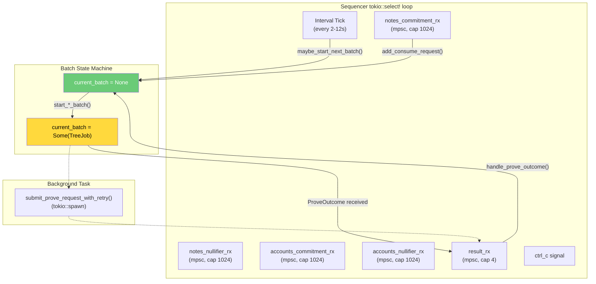
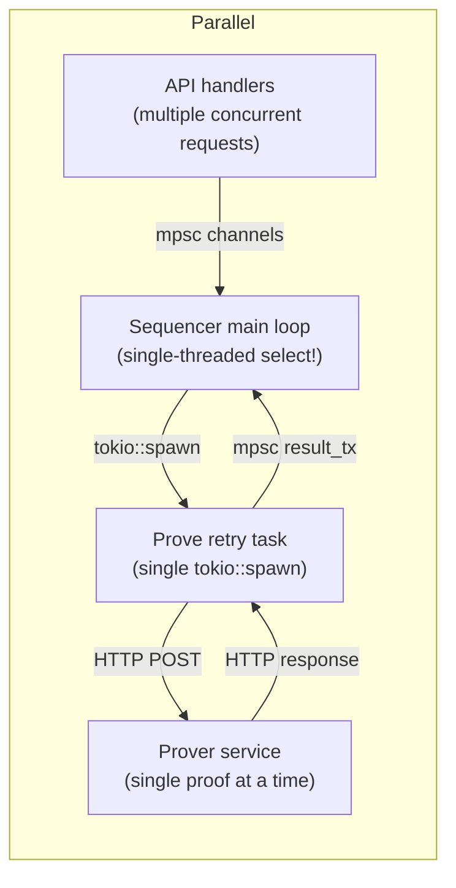

# Concurrency & Orchestration Model

## Sequencer Event Loop

The sequencer runs a single `tokio::select!` loop that multiplexes all input sources:



## Channels

| Channel | Type | Capacity | Producer | Consumer |
|---|---|---|---|---|
| `notes_commitment_tx/rx` | `mpsc` | 1024 | API handlers | Sequencer loop |
| `notes_nullifier_tx/rx` | `mpsc` | 1024 | API handlers | Sequencer loop |
| `accounts_commitment_tx/rx` | `mpsc` | 1024 | API handlers | Sequencer loop |
| `accounts_nullifier_tx/rx` | `mpsc` | 1024 | API handlers | Sequencer loop |
| `result_tx/rx` | `mpsc` | 4 | Background prove tasks | Sequencer loop |

## Batch State Machine

```mermaid
stateDiagram-v2
    [*] --> Idle: startup
    Idle --> Idle: tick (no pending)
    Idle --> InFlight: start_*_batch() [pending >= batch_size]
    Idle --> InFlight: start_*_batch() [0 < pending < batch_size AND timeout elapsed]
    InFlight --> Idle: ProveOutcome::Success (commit to chain + disk)
    InFlight --> Idle: ProveOutcome::Failure (reinsert batch)
    InFlight --> Idle: Receipt timeout (reinsert batch)
    InFlight --> InFlight: waiting for prover response
```

### Key Constraint: Single Batch In-Flight

Only **one** batch is in-flight at any time across all 4 trees. This is enforced by the `current_batch: Option<TreeJob>` field:

```rust
enum TreeJob {
    NotesCommitment,
    NotesNullifier,
    AccountsCommitment,
    AccountsNullifier,
}
```

### Batch Priority

When multiple trees are flushable (full or timed-out partial), the priority order is:

1. **NotesCommitment** (highest)
2. **NotesNullifier**
3. **AccountsCommitment**
4. **AccountsNullifier** (lowest)

This means under sustained load, accounts tree updates may be delayed in favor of notes trees.

## Background Tasks

### Prove Request Retry Task

Spawned by `submit_prove_request_with_retry()` via `tokio::spawn`:

```
loop {
    match client.prove(request).await {
        Ok(outcome) => { result_tx.send(outcome); return; }
        Err(_) => { sleep(5s); continue; }
    }
    if result_tx.is_closed() { return; }  // sequencer shut down
}
```

- Runs independently of the main loop
- Retries indefinitely with 5-second backoff
- Only one such task exists at a time (because only one batch is in-flight)
- Exits if the sequencer's `result_rx` is dropped (shutdown)

## Prover Concurrency

The prover service serializes all proof requests:

```rust
struct AppState {
    runtime: Arc<Mutex<ProverRuntime>>,
}
```

- `Arc<Mutex<...>>` ensures only one proof generates at a time
- `tokio::task::spawn_blocking()` moves CPU work off the async runtime
- The Go FFI (`Groth16Wrapper`) uses global state and cannot be parallelized

## Concurrent Paths



## Failure Recovery Matrix

| Event | State Transition | Side Effect |
|---|---|---|
| Request arrives, batch not full | Idle → Idle | Request queued; timeout window starts |
| Request arrives, batch now full | Idle → InFlight | Batch started |
| Interval tick, batch full | Idle → InFlight | Batch started |
| Interval tick, timed-out partial batch | Idle → InFlight | Partial batch padded with dummies and started |
| Interval tick, pending but not timed out | Idle → Idle | No-op |
| Prover returns Success | InFlight → Idle | Chain TX + disk commit |
| Prover returns Failure | InFlight → Idle | Batch re-queued |
| Chain TX reverts | InFlight → Idle | Batch re-queued |
| Receipt timeout (60s) | InFlight → Idle | Batch re-queued |
| Prover unreachable | InFlight → InFlight | Retry in 5s |
| Ctrl-C | Any → Shutdown | Graceful exit |
