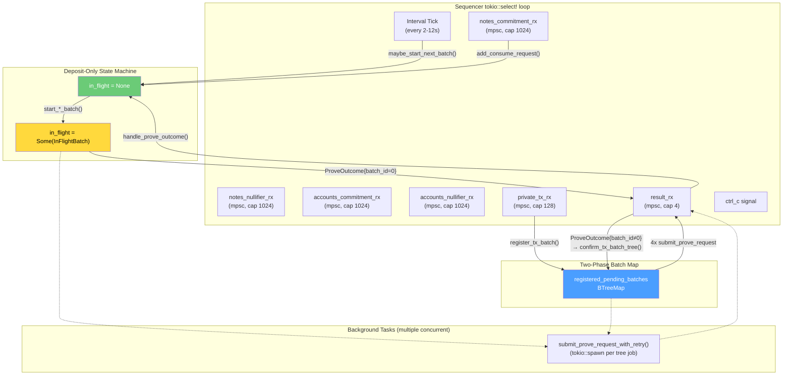
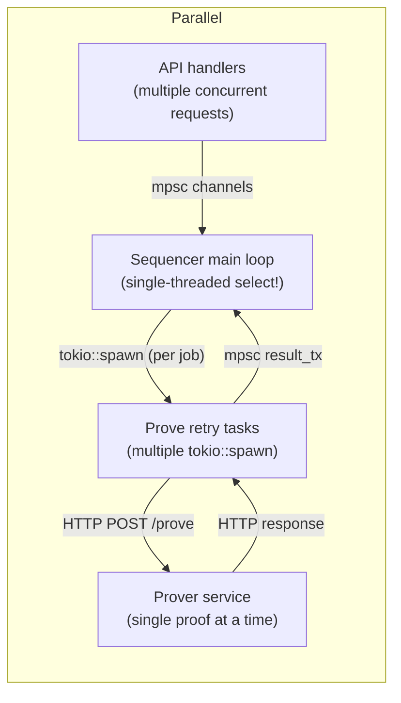

# Concurrency & Orchestration Model

## Sequencer Event Loop

The sequencer runs a single `tokio::select!` loop that multiplexes all input sources:



## Channels

| Channel | Type | Capacity | Producer | Consumer |
|---|---|---|---|---|
| `notes_commitment_tx/rx` | `mpsc` | 1024 | API `/consume-request` handler | Sequencer loop (deposit-only path) |
| `notes_nullifier_tx/rx` | `mpsc` | 1024 | API `/notes/nullifier` handler | Sequencer loop (deposit-only path) |
| `accounts_commitment_tx/rx` | `mpsc` | 1024 | API `/accounts/commitment` handler | Sequencer loop (deposit-only path) |
| `accounts_nullifier_tx/rx` | `mpsc` | 1024 | API `/accounts/nullifier` handler | Sequencer loop (deposit-only path) |
| `private_tx_tx/rx` | `mpsc` | 128 | API `/private-tx` handler | Sequencer loop (two-phase path) |
| `result_tx/rx` | `mpsc` | 4 | Background prove tasks | Sequencer loop (both paths) |

## Two Parallel Proving Paths

### Path A: Deposit-Only (per-tree, proof-gated)

Used by `/consume-request` and `/notes/*`, `/accounts/*` endpoints.

```mermaid
stateDiagram-v2
    [*] --> Idle: startup
    Idle --> Idle: tick (no pending)
    Idle --> InFlight: start_*_batch() [pending >= batch_size]
    Idle --> InFlight: start_*_batch() [0 < pending < batch_size AND timeout elapsed]
    InFlight --> Idle: ProveOutcome::Success{batch_id=0} (recordTree*Update + disk commit)
    InFlight --> Idle: ProveOutcome::Failure{batch_id=0} (reinsert batch)
    InFlight --> Idle: Receipt timeout (reinsert batch)
    InFlight --> InFlight: waiting for prover response
```

Only **one** deposit-only batch is in-flight at any time, enforced by `in_flight: Option<InFlightBatch>`.

### Path B: Two-Phase Optimistic (private TX)

Used by `/private-tx`. Multiple batches can be registered and proving concurrently.

```
On PrivateTxRequest:
  register_tx_batch() → registerTransactionBatchUpdate on-chain → batchId
  → store TxBatch in registered_pending_batches[batchId]
  → spawn 4 prove tasks (one per TREE_* index)

On ProveOutcome::Success{batch_id≠0, tree_index}:
  confirm_tx_batch_tree() → confirmTreeUpdate on-chain
  → local_confirmed_mask |= (1 << tree_index)
  → if mask == 0xF: remove from registered_pending_batches
```

### Batch Priority (Deposit-Only Path Only)

When multiple tree pools are ready, the deposit-only path uses this priority order:

1. **NotesCommitment** (highest)
2. **NotesNullifier**
3. **AccountsCommitment**
4. **AccountsNullifier** (lowest)

The two-phase path bypasses this priority system entirely — all four trees are processed together in a single `registerTransactionBatchUpdate` call.

## Background Prove Tasks

Spawned by `submit_prove_request_with_retry()` via `tokio::spawn`:

```
loop {
    match client.prove(request).await {
        Ok(outcome) => { result_tx.send(outcome); return; }
        Err(_)      => { sleep(5s); continue; }
    }
    if result_tx.is_closed() { return; }  // sequencer shut down
}
```

- Runs independently of the main loop
- Retries indefinitely with 5-second backoff
- **Multiple tasks can exist simultaneously**: up to 1 (deposit-only) + 4 × N (two-phase, where N = pending batch count)
- Exits if the sequencer's `result_rx` is dropped (shutdown)
- Routes to the correct handler via `batch_id` in `ProveOutcome`: `batch_id = 0` → deposit-only; `batch_id ≠ 0` → two-phase

## Prover Concurrency

The prover service serializes all proof requests behind a single mutex:

```rust
struct AppState {
    runtime: Arc<Mutex<ProverRuntime>>,
}
```

- `Arc<Mutex<...>>` ensures only one proof generates at a time
- `tokio::task::spawn_blocking()` moves CPU work off the async runtime
- The Go FFI (`Groth16Wrapper`) uses global state and cannot be parallelized
- Circuit switching between Commitment (trees 0, 2) and Nullifier (trees 1, 3) requires reloading keys

## Concurrent Paths



## Failure Recovery Matrix

| Event | Path | State Transition | Side Effect |
|---|---|---|---|
| Request arrives, pool not full | Deposit-only | Idle → Idle | Request queued; timeout window starts |
| Request arrives, pool now full | Deposit-only | Idle → InFlight | Batch started |
| Interval tick, pool full or timed-out | Deposit-only | Idle → InFlight | Partial batch padded with dummies |
| Prover returns Success{batch_id=0} | Deposit-only | InFlight → Idle | `record*TreeUpdate` + disk commit |
| Prover returns Failure{batch_id=0} | Deposit-only | InFlight → Idle | Batch re-queued |
| Receipt timeout (60s) | Deposit-only | InFlight → Idle | Batch re-queued |
| Prover unreachable | Both | InFlight / pending | Retry in 5s |
| `/private-tx` received | Two-phase | — → registered | All 4 trees applied + 4 prove tasks spawned |
| Prover returns Success{batch_id≠0} | Two-phase | — → confirmed (partial/full) | `confirmTreeUpdate` on-chain per tree |
| `confirmTreeUpdate` reverts | Two-phase | — | Log warning; retry |
| All 4 trees confirmed (mask=0xF) | Two-phase | — → removed | Batch freed from `registered_pending_batches` |
| Ctrl-C | Both | Any → Shutdown | Graceful exit |
